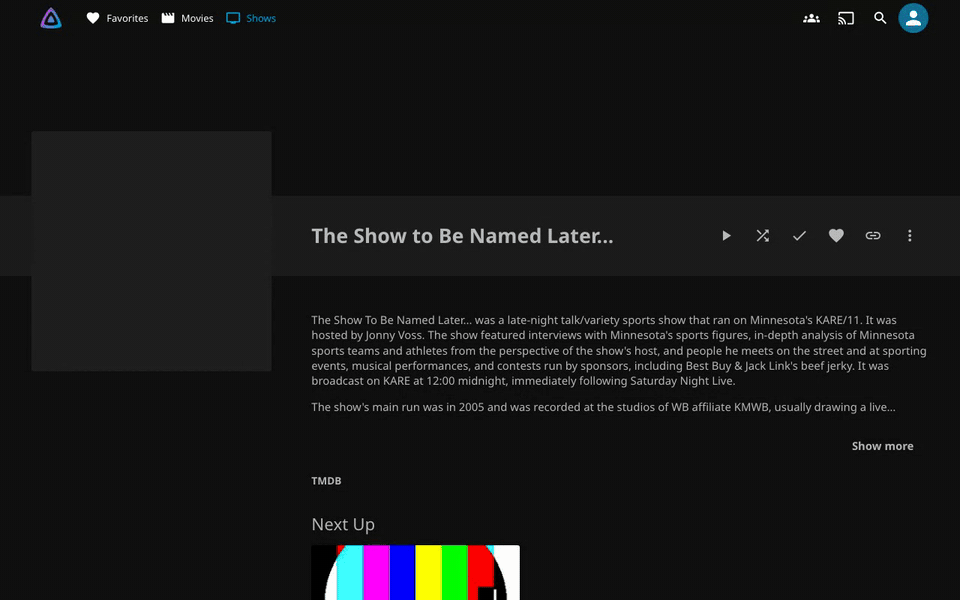
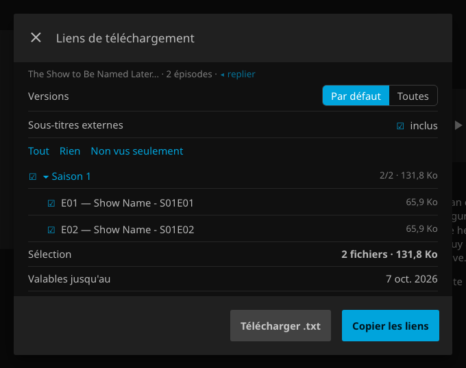
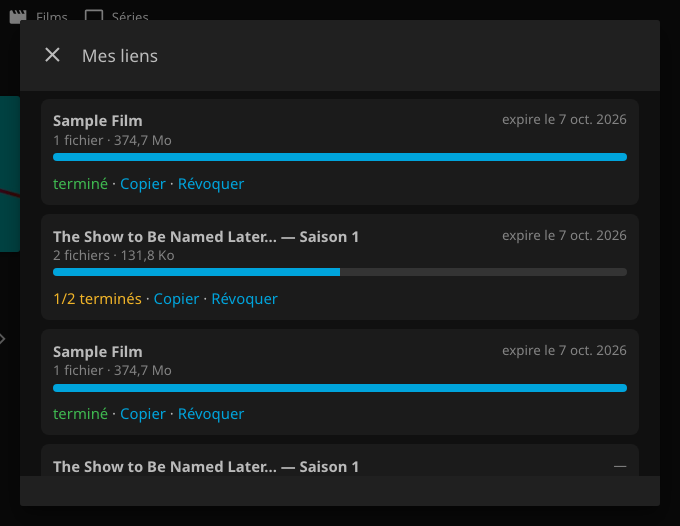
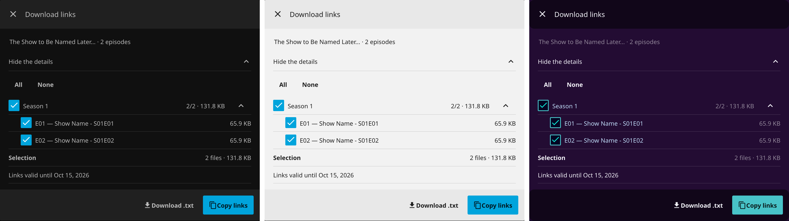
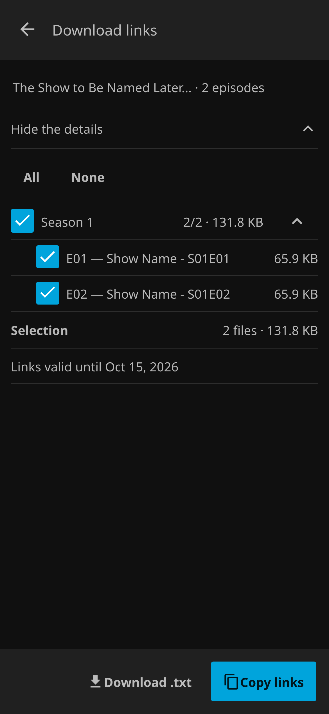
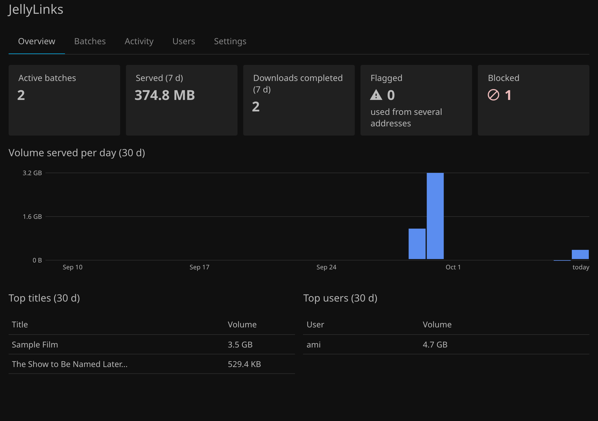
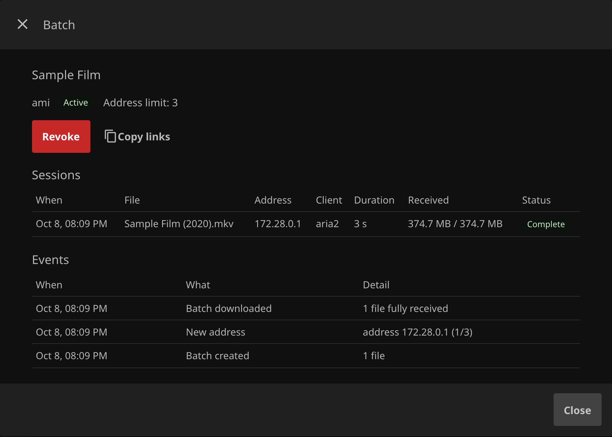

# JellyLinks - A Jellyfin Plugin

      


Give the people you share your library with direct download links to the original files (a movie, a season, a whole
series) that they paste into JDownloader or any download manager. You keep control: links expire, can be revoked, are
capped per address and per quota, and every download is on record.

JellyLinks never downloads anything itself and never transcodes: it serves your files as they are.

## Features



- 🔗 **Download links** on movie, series, season and episode pages, in the "…" menus and in multi-selection.
- ✅ **Pick what you need**: all versions or the default one, external subtitles, whole seasons or single episodes,
  unplayed only. Totals update as you tick.
- 📋 **Copy the links or save a `.txt`**, one URL per line, straight into your download manager.
- 🗂️ **My links**: every set of links with its progress; copy again, revoke, or get new links once they expire.
- ⏳ **Signed, expiring links** (7 days by default). A renamed file keeps its link working; a deleted one answers `410`.
- ⏯️ **Resumable downloads**: byte ranges, `ETag` and `If-Range`, parallel chunks.
- 🛡️ **Sharing guard and quotas**: a batch used from more addresses than allowed (3 by default) is blocked until you
  release it; optional quotas on volume and active batches, globally or per user.
- 📊 **Admin panel**: volume per day and per user, every batch and session, an activity log, quota exceptions, alerts
  to Jellyfin's activity log and to a webhook (ntfy or JSON).
- 🎨 **Looks like Jellyfin**: built from Jellyfin's own controls, it follows your theme, built-in or custom.
- 🌍 **Speaks your language**: English by default, French included, following the language set in Jellyfin. Another
  language is one more object in [`Client/strings.json`](Jellyfin.Plugin.JellyLinks/Client/strings.json), with the same keys.

## Prerequisites

1. **Jellyfin 10.11.10+ or 12.0.**
2. **[JavaScript Injector](https://github.com/n00bcodr/Jellyfin-JavaScript-Injector) 4.0+**: it delivers Download links
   and My links to the web interface. JellyLinks registers its script by itself; there is nothing to paste. Add the
   repository matching your server in **Dashboard → Plugins → Repositories**:

   ```plain
   https://raw.githubusercontent.com/n00bcodr/jellyfin-plugins/main/10.11/manifest.json
   https://raw.githubusercontent.com/n00bcodr/jellyfin-plugins/main/12/manifest.json
   ```

   File Transformation is **not** required.

## Installation

Add the JellyLinks repository in **Dashboard → Plugins → Repositories**:

```plain
https://raw.githubusercontent.com/MorganKryze/JellyLinks/main/manifest.json
```

Then install **JellyLinks** from the Catalog and restart Jellyfin.

Only users with **"Allow media downloading"** (user profile → access) see Download links, and that permission is
checked again on every request.

### Manual

Download `Jellyfin.Plugin.JellyLinks.zip` from the [latest release](https://github.com/MorganKryze/JellyLinks/releases/latest),
unzip it into a `JellyLinks` folder inside Jellyfin's `plugins` directory, and restart Jellyfin.

## Uninstalling

Uninstall from **Dashboard → Plugins**. The plugin's data stays in `plugins/Jellyfin.Plugin.JellyLinks/` (its database
and signing key), so an update or a reinstall keeps your batches. Delete that folder to remove everything; otherwise a
reinstall brings back the links that have not expired yet.

## Using JellyLinks

Open a movie or a series, choose **Download links**, pick what to include, then **Copy links** or **Download .txt**.



**My links** (in the user menu and in Settings) lists everything you shared, active first, with the progress of each
file.



JellyLinks uses Jellyfin's own controls, so it follows your theme, here Dark, Light and Purple Haze:



On a phone, the dialog opens full screen like Jellyfin's own.



## Admin panel

**Dashboard → Plugins → JellyLinks.**



| Tab | What you do there |
| --- | --- |
| Overview | active batches, volume served and downloads completed (7 days), flagged and blocked batches; volume per day and per user, top titles and users |
| Batches | search and filter; open a batch to see each session (time, file, address, client, duration, received / size, status); unblock, unblock and allow one more address, revoke, copy its links |
| Activity | the log of sessions and events, searchable and filterable |
| Users | permission, effective quota, usage, active batches, archived totals; set or remove a quota exception |
| Settings | link validity, address limit, global quota, retention, public address, webhook (with a test button), and **Revoke everything** (a new signing key: every link ever issued stops working) |



## Behind a reverse proxy

- Declare your proxies in **Dashboard → Networking → Known proxies**, otherwise every download seems to come from the
  proxy and the address limit means nothing. Check an entry of the activity log after a connection from outside: it
  must show the client's public address.
- Set **Settings → Public address of the links** (e.g. `https://jellyfin.example`) if the address Jellyfin sees is not
  the one your users reach.

## Privacy and data

| | |
| --- | --- |
| **What is stored** | batches and their files; for each download session, the client's address, its user agent, times and bytes received; a log of events (batch created, new address, blocked, revoked…) |
| **Where** | `jellylinks.db` in the plugin's folder, never in Jellyfin's own database |
| **For how long** | session details and events are kept for the retention period (90 days by default, Settings → Retention), then folded into monthly totals per user and title, without any address |
| **Who sees it** | administrators only, in the admin panel; users see their own batches and their progress |
| **What leaves the server** | nothing, except the alerts you send to a webhook if you set one up |
| **What JellyLinks never does** | geolocation, telemetry, changing or moving your files, transcoding |

## FAQ

<details>
<summary>Why do the links work without signing in to Jellyfin?</summary>

Download managers cannot sign in. Each link carries a signature instead, tied to one file and an expiry date. It
stops working when it expires, when the batch is revoked or blocked, or when the user loses the download permission or
access to the library.
</details>

<details>
<summary>What happens if a file is renamed or replaced?</summary>

JellyLinks finds a renamed file again and the link keeps working, as long as exactly one match exists in the same
library: the same series, season and episode for an episode, the same provider ids (else the same title and year) for
a movie. If there is no match or more than one, it never guesses and the link answers `410`. A file replaced in place
keeps its link too. A deleted file answers `410`.
</details>

<details>
<summary>A batch is blocked. Why, and what do I do?</summary>

It was used from more distinct addresses than the limit allows (3 by default), which usually means the links were passed
on. Open it in **Batches** to see the addresses, then unblock it, unblock it and allow one more address, or revoke it.
</details>

<details>
<summary>Can my users copy links in the Jellyfin mobile apps?</summary>

The Download links button is part of the web interface, delivered by JavaScript Injector. It works in browsers,
including on phones; the native apps do not run injected scripts.
</details>

<details>
<summary>Can a link be shared?</summary>

A link works for whoever has it until it expires, within the batch's address limit. Share the links with people you
trust, and revoke a batch as soon as you no longer want it used.
</details>

## Troubleshooting

| Symptom | Cause |
| --- | --- |
| No Download links button | JavaScript Injector missing or inactive (the admin panel shows a warning), or the user lacks "Allow media downloading" |
| The address limit never triggers; every session shows the same address | the proxy is not in Known proxies: Jellyfin sees the proxy's address instead of the client's |
| `404` on a link | the link is malformed or was never valid |
| `403` on a link | the batch was revoked or blocked, or the user lost the permission or access to the library |
| `410` on a link | the batch expired, or the file is gone (a rename is followed; a deletion is not) |
| `429` on a link | the user's quota is reached for the current window |

## Project status

JellyLinks is maintained and used every day on its author's server. It is tested on Jellyfin 10.11.10 and 12.0 with the
web client, behind a reverse proxy, with JDownloader.

## Development

```bash
just test          # server (xUnit) and client (node) tests
just v10           # build and run Jellyfin 10.11.10 on http://localhost:8098
just v12           # same with Jellyfin 12.0 on http://localhost:8097
just jsinjector v10
just brand         # rebuild the logo and images from assets/brand/
just package 0.3.0 # the release ZIP, as the CI builds it
```

## Security

See [SECURITY.md](.github/SECURITY.md) for what JellyLinks protects and how to report a vulnerability privately.

## AI Disclosure

A colophon tells how the book was made, so here is mine: C#, plain SQL, a few hundred lines of
unbundled JavaScript, and [Claude Code](https://claude.com/claude-code) drafting at my side, never on
autopilot. The taste, the reviews and the final word stay mine; the tests, the CI and the public history
keep me honest.

## License

Free software under [GPL-3.0](LICENSE): use it, modify it, share it. What you redistribute stays under
the same license, source included. Running it on your own server is not distribution and asks nothing of you.
